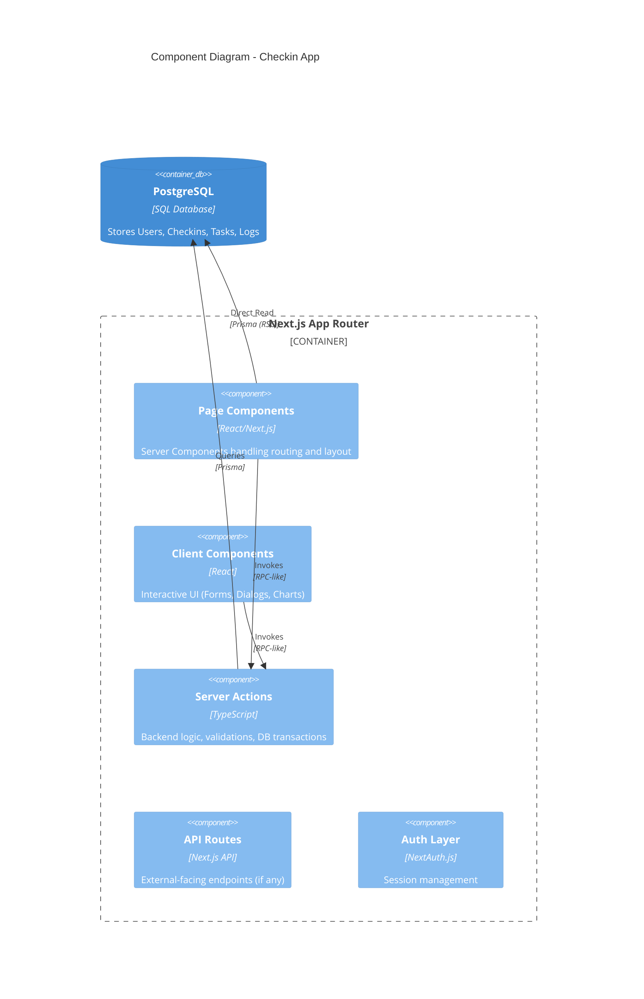

# Component Architecture

## C4 Container/Component Diagram

## detailed Component Interaction (Example: Task Marketplace)

1. **User** navigates to `/tasks`.
2. **`page.tsx` (RSC)** fetches `TaskItems` directly from Prisma.
3. **`MarketplaceList.tsx` (Client)** renders the items.
4. **User** clicks "Claim Task".
5. **`MarketplaceList`** calls `claimTask` **Server Action**.
6. **`claimTask`**:
    - Validates session.
    - Updates DB (`TaskItem.assignee`).
    - Creates `UserTask` record.
    - Revalidates path `/tasks`.
7. **UI** updates optimistically or via refresh.
