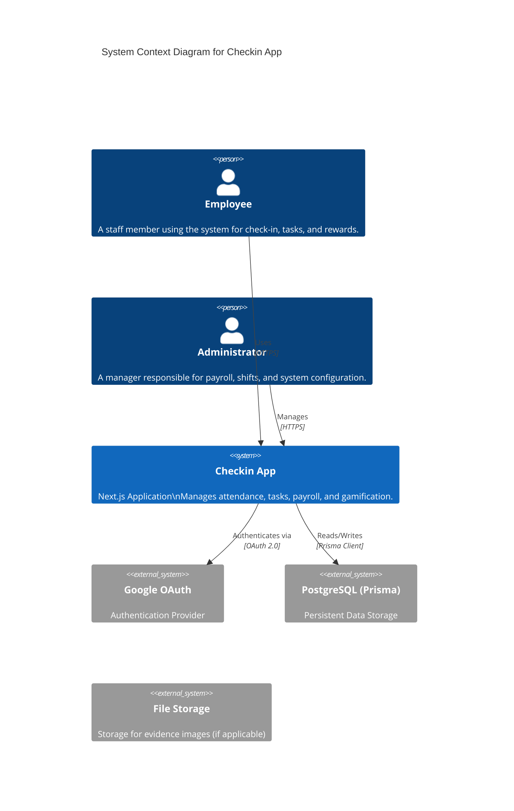

# System Design Document: Checkin App

## 1. System Overview

The **Checkin App** is a comprehensive internal management system designed to streamline HR processes, task management, and employee engagement. It features geofenced attendance tracking, a rewards system (Lucky Wheel), request management (leave/late), and a task marketplace for internal gigs.

### 1.1 Goals
- **Automate Attendance**: Eliminate manual timesheets with IP-based check-ins.
- **Enhance Engagement**: Gamify work with a "Lucky Wheel" and "Shop Pet" system.
- **Streamline Operations**: Centralize shift management, payroll calculations, and request approvals.

## 2. System Context (C4 Level 1)

## 3. Technology Stack

### Frontend & Backend
- **Framework**: Next.js 14+ (App Router)
- **Language**: TypeScript
- **Styling**: Tailwind CSS, Shadcn UI, Headless UI
- **State Management**: React Server Components, Server Actions

### Data & Infrastructure
- **Database**: PostgreSQL
- **ORM**: Prisma
- **Auth**: NextAuth.js (v5 beta / Auth.js)
- **Deployment**: Vercel (recommended) / VPS

## 4. Key Modules

| Module | Description |
| :--- | :--- |
| **Attendance** | IP-based check-in/out logic, shift validation. |
| **Payroll** | Automated calculation of variable salary based on hourly rates and shifts. |
| **Tasks** | "Marketplace" where admins post tasks -> users claim -> admins review. |
| **Gamification** | Lucky Wheel, Shop Pet (Tamagotchi-style), Achievements. |
| **Requests** | Workflow for leave, late arrival, and WFH requests. |

## 5. Security Architecture
- **Authentication**: Secure sessions via NextAuth using Google Provider.
- **Authorization**: Role-Based Access Control (RBAC) separating `USER` and `ADMIN`.
- **Validation**: Server-side validation (Zod) for all inputs.
- **Infrastructure**: IP Allow-listing for attendance verification.
