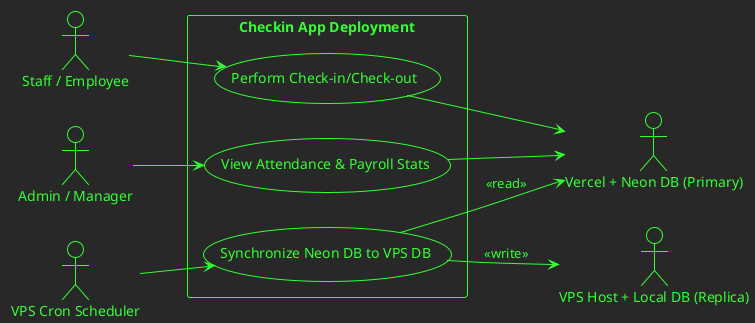
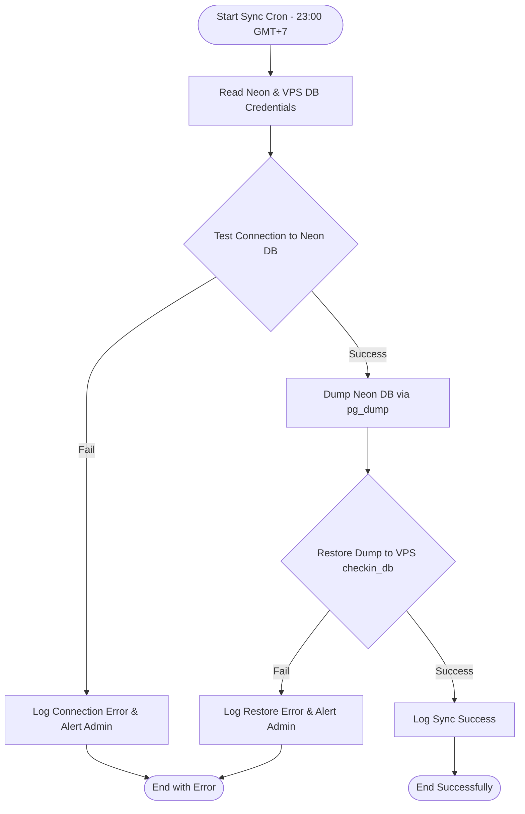
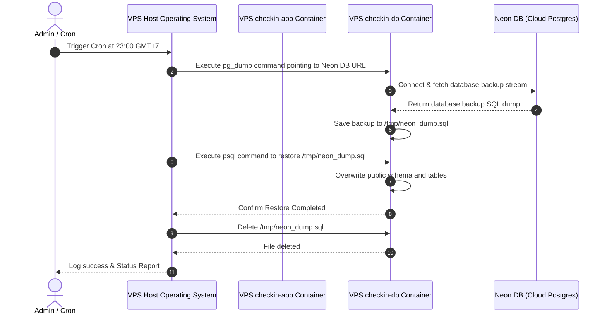

# Technical Specification: Rollback to Vercel + Neon DB

This document details the architectural rollback of the primary **Checkin App** deployment from the Contabo VPS to **Vercel** pointing to the cloud-hosted **Neon DB**, and the setup of a daily synchronization job to keep the VPS deployment updated as a parallel instance.

## Title & Scope Overview

* **Background**: The application was previously migrated from Vercel to a self-hosted Contabo VPS (`limart.khanhdp.com`) using a local Dockerized PostgreSQL database.
* **Problem Statement**: Running two active deployments with separate databases led to data split-brain issues. Check-ins and check-outs recorded by staff on the Vercel/PWA deployment (pointing to Neon) were invisible to administrators viewing the dashboard on the VPS domain, causing inconsistent payroll and attendance stats.
* **Solution**: 
  1. Revert the primary environment to Vercel + Neon DB by removing Vercel host redirects.
  2. Keep the VPS deployment running as an independent, parallel backup instance.
  3. Schedule a daily cron job at **23:00 GMT+7** (16:00 UTC) on the VPS to dump the Neon DB and overwrite the local VPS database, ensuring the backup instance remains in sync with production.

---

## Workflows & Visualizations

### 1. Use Case Diagram



### 2. Overview Flow (System Synchronization Flow)



### 3. Component Interaction (Cron Sync Sequence)



---

## Technical Changes

The redirect rules configured in `next.config.mjs` and `vercel.json` have been removed to restore normal routing on Vercel.

```diff
diff --git a/next.config.mjs b/next.config.mjs
-  async redirects() {
-    return [
-      {
-        source: '/:path*',
-        has: [
-          {
-            type: 'header',
-            key: 'host',
-            value: '(?<vercelHost>.*\\.vercel\\.app)',
-          },
-        ],
-        destination: 'https://limart.khanhdp.com/:path*',
-        permanent: true,
-      },
-    ];
-  },
diff --git a/vercel.json b/vercel.json
-    "redirects": [
-        {
-            "source": "/:path*",
-            "destination": "https://limart.khanhdp.com/:path*",
-            "permanent": true
-        }
-    ],
```

---

## Manual Operation Guide

### Immediate Data Synchronization Script
An immediate data migration and deduplication script has been created at [migrate_checkins.js](file:///Users/kido/checkin-app/scripts/migrate_checkins.js) and resolved with [resolve_duplicates.js](file:///Users/kido/checkin-app/scripts/resolve_duplicates.js). It handles timezone shifts correctly by treating all dates in UTC.

To trigger a manual database sync from Neon to the VPS database:
```bash
/opt/checkin-app/scripts/sync-db.sh
```

---

## Cloud / Infrastructure Setup

### Environment Variables
Vercel production and local environments both point to the Neon DB:

| Parameter | Vercel Value | VPS Local Value |
| :--- | :--- | :--- |
| `DATABASE_URL` | Neon DB Connection String | VPS Local checkin-db Connection String |
| Primary Domain | `checkin-lim-art.vercel.app` | `limart.khanhdp.com` |

---

## Troubleshooting

1. **Daily Cron Failures**:
   - Check VPS cron log: `tail -n 50 /var/log/cron` or `journalctl -u cron`
   - Test connectivity from the VPS to Neon: `docker exec checkin-db pg_isready -h ep-orange-dust-a1m4z6so-pooler.ap-southeast-1.aws.neon.tech`
2. **Schema out of sync**:
   - If schema changes are pushed to `main`, they will automatically sync to VPS. If VPS is out of sync, run:
     ```bash
     docker compose exec checkin-app npx prisma db push --skip-generate
     ```
