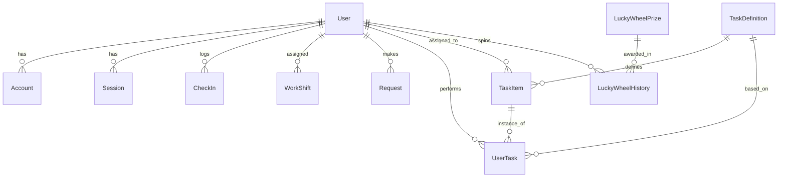

# Database Schema

The **Checkin App** uses PostgreSQL managed by Prisma ORM.

## Core Entities

### User & Auth
- **User**: The central entity. Stores profile, role (`USER`/`ADMIN`), employment type (`FULL_TIME`/`PART_TIME`), and salary info.
- **Account**: NextAuth.js OAuth accounts (Google).
- **Session**: NextAuth.js sessions.

### Attendance & Work
- **CheckIn**: Records timestamp, type (`IN`/`OUT`/`LUNCH_IN`...), and IP address.
- **WorkShift**: Assigned shifts for users. Supports swapping (`isOpenForSwap`).
- **AllowedIP**: Whitelisted IP prefixes for valid check-ins.

### Tasks (Marketplace)
- **TaskDefinition**: Template for a task (e.g., "Write Blog Post", base reward).
- **TaskItem**: An instance of a task posted to the marketplace.
- **UserTask**: A task claimed/performed by a user. Tracks status (`PENDING`, `APPROVED`, `REJECTED`) and evidence.

### Requests
- **Request**: Leave, Late, WFH requests. Status (`PENDING`, `APPROVED`, `REJECTED`).

### Gamification & Rewards
- **LuckyWheelPrize**: Configurable prizes with probabilities and quantities.
- **LuckyWheelHistory**: Log of user spins and prizes won.
- **UserAchievement**: Badges/achievements unlocked by users.
- **ShopPet**: Global or user-specific pet stats (Tamagotchi).

### System
- **Announcement**: Global system announcements.
- **Holiday**: Configurable holidays with multipliers for salary calculation.
- **StickyNote**: User-specific dashboard notes.

## ER Diagram (Mermaid)

## detailed Model Reference

### User
| Field | Type | Description |
| :--- | :--- | :--- |
| `role` | `UserRole` | `ADMIN` or `USER`. Controls access. |
| `employmentType` | `EmploymentType` | `FULL_TIME` or `PART_TIME`. Impacts payroll. |
| `hourlyRate` | `Float` | For part-time calculation. |
| `monthlySalary` | `Float` | For full-time calculation. |

### TaskItem (Marketplace)
| Field | Type | Description |
| :--- | :--- | :--- |
| `status` | `String` | `OPEN`, `IN_PROGRESS`, `CLOSED`. |
| `assigneeId` | `String?` | User who claimed the task. |

### UserTask (Submission)
| Field | Type | Description |
| :--- | :--- | :--- |
| `evidenceLink` | `String?` | URL to proof of work. |
| `finalAmount` | `Float?` | Actual amount paid (can differ from base reward). |
