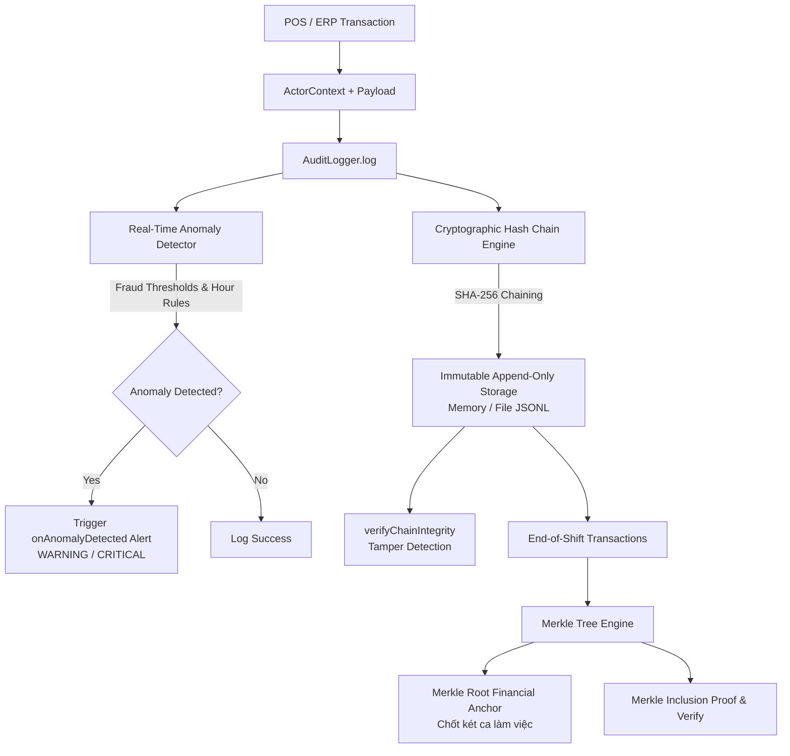

# @kt/audit-trail

> **Cryptographic Audit Trail Engine**: Internal SHA-256 Hash Chaining, Real-Time Tamper Detection, Merkle Tree End-of-Shift Financial Anchoring, and Real-Time POS/ERP Fraud Anomaly Detection.

---

## 📌 Architecture Overview



---

## 🚀 Key Features

1. **Cryptographic Hash-Chaining (Internal Blockchain Log)**:
   - Every record links to its predecessor via `previousHash`.
   - `currentHash = SHA256(previousHash + timestamp + actor.userId + action + canonicalJsonStringify(payload) + nonce)`.
   - Deterministic key sorting (`canonicalJsonStringify`) guarantees consistent hashes regardless of JavaScript object key order.
   - `verifyChainIntegrity(records)`: pinpoint immediately any inserted, altered, or deleted record.

2. **Merkle Tree Shift Anchoring**:
   - Compresses $N$ shift transactions into a single 32-byte cryptographic root (`merkleRoot`).
   - Anchors daily cash drawer closing and financial audit reports for company executives.
   - Generates lightweight inclusion proofs (`generateProof`) and verifies proofs without reading the entire dataset (`verifyProof`).

3. **Real-Time Anomaly & Fraud Detection**:
   - `ORDER_CANCEL`:
     - Cancellation $> 500.000$ VND: `WARNING`
     - Cancellation $> 5.000.000$ VND: `CRITICAL`
     - Cancellation during night hours (22:00 - 06:00): `CRITICAL`
   - `PRICE_OVERRIDE`:
     - Discount $> 10\%$: `WARNING` (or `CRITICAL` if triggered by a `CASHIER`)
     - Discount $> 30\%$: `CRITICAL`
   - `CASH_DRAWER_OPEN`:
     - Discrepancy $> 200.000$ VND: `WARNING`
     - Discrepancy $> 1.000.000$ VND: `CRITICAL`
     - Manual drawer opening with `NO_SALE`: `WARNING`
   - `DEBT_WRITEOFF`:
     - Debt write-off $> 1.000.000$ VND without `ADMIN` role: `CRITICAL`
   - Custom extensible rule engine.

4. **Production-Grade Append-Only Logger**:
   - In-memory adapter with `Object.freeze` immutability.
   - File streaming adapter appending JSON lines (`.jsonl`) with crash recovery and chain resumption.
   - Real-time `onAnomalyDetected` webhook callback.

---

## 📦 Installation

```bash
pnpm add @kt/audit-trail
```

---

## 💡 Usage Examples

### 1. Initialize Logger & Log Transactions

```typescript
import { AuditLogger, FileStreamingStorageAdapter } from '@kt/audit-trail';

const logger = new AuditLogger({
  storage: new FileStreamingStorageAdapter('./storage/audit.jsonl'),
  onAnomalyDetected: async (entry, anomalies) => {
    console.warn(`[FRAUD ALERT] Action ${entry.action} triggered:`, anomalies);
    // Send Slack / Zalo / Telegram notification to store owner
  },
});

await logger.initialize();

// Log order creation
const { entry, anomalies } = await logger.log({
  actor: {
    userId: 'usr_cashier_01',
    role: 'CASHIER',
    ipAddress: '192.168.1.100',
    userAgent: 'Sunmi-POS-T2',
    branchId: 'BRANCH_D1_HCMC',
  },
  action: 'ORDER_CREATE',
  entityId: 'ORD_20260930_001',
  payload: { total: 450000, paymentMethod: 'VIETQR' },
});
```

### 2. Instant Tamper Detection (Chain Integrity)

```typescript
const result = await logger.verifyIntegrity();

if (!result.isValid) {
  console.error(`🚨 DATA TAMPERED at index ${result.tamperedIndex}!`);
  console.error(`Record ID: ${result.tamperedRecordId}`);
  console.error(`Reason: ${result.reason}`);
} else {
  console.log(`✅ Audit chain 100% verified (${result.totalRecords} records).`);
}
```

### 3. Merkle Tree End-of-Shift Financial Anchoring

```typescript
import { MerkleTree } from '@kt/audit-trail';

// Anchor shift transactions
const snapshot = await logger.createShiftSnapshot('SHIFT_20260930_CA1', {
  branchId: 'BRANCH_D1_HCMC',
  metadata: {
    cashier: 'Nguyen Van A',
    expectedCash: 12500000,
    actualCash: 12500000,
  },
});

console.log('Shift Merkle Root:', snapshot.merkleRoot);
// Securely store snapshot.merkleRoot into Master Ledger / Daily Close Report
```

### 4. Merkle Inclusion Proof & Verification

```typescript
const entries = await logger.getEntries();
const tree = new MerkleTree(entries);

// Generate proof for transaction index 3
const proof = tree.generateProof(3);

// Verify leaf inclusion against root
const isValid = MerkleTree.verifyProof(proof.leafHash, proof.proof, tree.getRoot());
console.log('Transaction verified in shift:', isValid); // true
```

---

## 🧪 Testing

```bash
pnpm run test
pnpm run typecheck
pnpm run build
```
