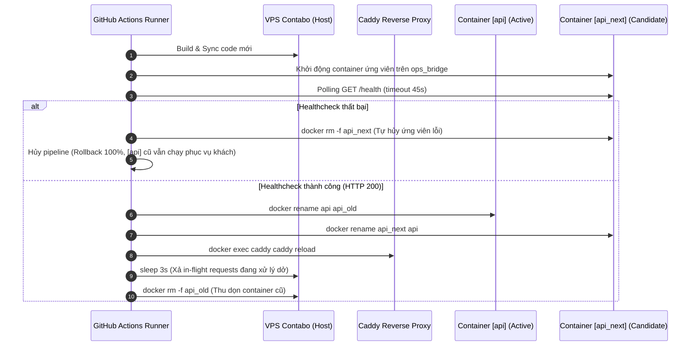

# @checkin/zero-downtime-deploy

> **Universal Zero-Downtime Deployment Toolkit (Package #31)**
> Cung cấp cơ chế triển khai Blue-Green Atomic Swap 100% Zero-Downtime cho cả Fullstack Backend (Docker/Bun/Node) và Frontend (Vite/React/Nginx/Caddy) trên hạ tầng VPS Contabo / Cloudflare.

---

## 🎯 Vấn Đề Thực Tế (The Real-World Deployment Problem)

Khi triển khai ứng dụng web lên VPS hoặc server truyền thống, các phương pháp phổ thông thường gây gián đoạn dịch vụ:
1. **Downtime ở Frontend (Static SPA)**: Quá trình `rsync` hoặc `cp -r` đè trực tiếp vào thư mục web đang phục vụ khiến người dùng tải phải file HTML mới nhưng trỏ đến file JS cũ đã bị xóa, hoặc tải phải file JS đang ghi dở -> Lỗi **White Screen / 404 ChunkLoadError**.
2. **Downtime ở Backend (Docker Container)**: Lệnh `docker compose up -d` hoặc `docker restart` truyền thống sẽ dừng (stop) container cũ trước, sau đó mới khởi động container mới. Trong khoảng thời gian container mới khởi động và nạp bộ nhớ (từ 5s đến 30s), toàn bộ request từ người dùng sẽ nhận mã lỗi **HTTP 502 Bad Gateway**.
3. **Thiếu Auto-Rollback**: Nếu phiên bản mới có lỗi crash lúc khởi động (Runtime Error, thiếu env var, lỗi migration), container mới sập và container cũ đã bị xóa -> Toàn bộ hệ thống sập hoàn toàn cho đến khi dev sửa tay.

---

## 💡 Giải Pháp Blue-Green Atomic Swap Của `@checkin/zero-downtime-deploy`

Package `@checkin/zero-downtime-deploy` giải quyết triệt để 3 vấn đề trên bằng 2 cơ chế độc quyền:

### 1. Inode Atomic Directory Swap cho Frontend (< 1ms)
- Quá trình deploy build static web ở runner GitHub Actions, sau đó sync toàn bộ file vào thư mục staging `apps/<app>_next`.
- Khi sync hoàn tất 100%, thực hiện hoán đổi nguyên tử thông qua lệnh kernel `mv`:
  ```bash
  mv /opt/kido-infra/docker/portfolio/html/apps/<app> /opt/kido-infra/docker/portfolio/html/apps/<app>_backup
  mv /opt/kido-infra/docker/portfolio/html/apps/<app>_next /opt/kido-infra/docker/portfolio/html/apps/<app>
  rm -rf /opt/kido-infra/docker/portfolio/html/apps/<app>_backup
  ```
- **Nguyên lý OS**: Trên hệ thống tệp Linux (ext4/NVMe), lệnh `mv` giữa hai thư mục trên cùng một mount point là thao tác cập nhật con trỏ inode của nhân hệ điều hành diễn ra trong **dưới 1 millisecond** (< 1ms). Web server (Nginx/Caddy) không bao giờ nhìn thấy trạng thái thư mục rỗng hoặc file chưa ghi xong.

### 2. Blue-Green Container Atomic Swap cho Backend API (0ms Downtime)
Quy trình hoán đổi container động theo chuẩn 6 bước:


### 3. Graceful Shutdown & Connection Draining Controller (`setupGracefulShutdown`)
Đảm bảo khi ứng dụng nhận tín hiệu tắt (`SIGTERM`, `SIGINT`), toàn bộ request in-flight được xử lý xong và tài nguyên được giải phóng hoàn toàn:
- Đóng kết nối idle HTTP keep-alive (`closeIdleConnections`).
- Dừng nhận kết nối mới và drain các HTTP in-flight requests (`server.close()`).
- Thực thi hook dọn dẹp tài nguyên (ngắt kết nối Prisma DB, Redis cache, Message Queue, v.v.) qua `onShutdown`.
- Ngăn ngừa tình trạng double-execution khi nhận nhiều tín hiệu tắt liên tiếp.
- Cơ chế Safety Timer (`timeout.unref()`) tự động ép tắt an toàn (`exit(1)`) nếu teardown bị treo quá `timeoutMs` (mặc định 10s).

```typescript
import { setupGracefulShutdown } from '@checkin/zero-downtime-deploy';

const shutdownController = setupGracefulShutdown({
  server: () => httpServer,
  timeoutMs: 10000,
  signals: ['SIGTERM', 'SIGINT'],
  onShutdown: async (signal) => {
    await prisma.$disconnect();
    await redis.quit();
  },
  autoRegister: true,
});
```

---

## 📦 Cấu Trúc Thư Mục Của Package

```
packages/zero-downtime-deploy/
├── package.json          # Name: "@kt/zero-downtime-deploy", Version: "1.0.0"
├── README.md             # Tài liệu chuẩn hóa kiến trúc Zero-Downtime
├── scripts/
│   ├── atomic-swap-be.sh # Script Blue-Green Container Swap cho Docker/Bun/Node
│   ├── atomic-swap-fe.sh # Script Inode Directory Swap cho Web Static / Nginx
│   └── health-check.sh   # Healthcheck probe có retry & auto rollback
├── workflows/
│   └── deploy.yml.template # Mẫu GitHub Actions workflow chuẩn
└── src/
    ├── index.ts          # Generator functions & programmatic health check
    └── cli.ts            # CLI scaffolding tool
```

---

## 🚀 Hướng Dẫn Tích Hợp Vào Bất Kỳ Repo Nào Khi Tách Kho (Repo Detach Guide)

Khi tách một ứng dụng từ monorepo `kt-porfolio` thành kho độc lập (như `flash-buy`, `tikat-story`, v.v.), hãy làm theo hướng dẫn dưới đây để có ngay CI/CD Zero-Downtime:

### Bước 1: Khởi Tạo Tự Động Bằng CLI

Trong thư mục gốc của repository mới, chạy lệnh:
```bash
npx @kt/zero-downtime-deploy init <tên-ứng-dụng> <url-healthcheck>
```
*Ví dụ:*
```bash
npx @kt/zero-downtime-deploy init flashbuy https://flashbuy.tikat.vn/health
```
Lệnh trên sẽ tự động:
1. Tạo file `.github/workflows/deploy.yml` với cấu hình Blue-Green swap chuẩn.
2. Tạo thư mục `scripts/deploy/` chứa `atomic-swap-be.sh` và `atomic-swap-fe.sh`.

---

### Bước 2: Cấu Hình GitHub Secrets

Vào repository trên GitHub -> **Settings** -> **Secrets and variables** -> **Actions**, thêm 3 secrets:
- `SSH_PRIVATE_KEY`: Khóa SSH RSA/Ed25519 dùng để kết nối vào VPS Contabo.
- `VPS_HOST`: Địa chỉ IP của VPS (ví dụ: `144.91.88.242`).
- `SSH_USER`: Tên tài khoản SSH (mặc định: `root`).

---

### Bước 3: Cấu Hình Docker Compose Trên VPS

Đảm bảo file `docker/vps-docker-compose.yml` trên VPS sử dụng mạng chung `ops_bridge` để Caddy có thể reverse proxy:
```yaml
version: '3.8'

services:
  flashbuy-api:
    image: flashbuy-api:latest
    container_name: flashbuy-api
    restart: unless-stopped
    networks:
      - ops_bridge
    env_file:
      - .env
    volumes:
      - /opt/kido-infra/apps/flashbuy-api/dist:/app/dist:ro
      - /opt/kido-infra/data/flashbuy:/app/data

networks:
  ops_bridge:
    external: true
```

---

### Bước 4: Kiểm Thử Độc Lập

Chạy thử script kiểm tra sức khỏe hệ thống:
```bash
# Sử dụng CLI
npx @kt/zero-downtime-deploy check https://flashbuy.tikat.vn/health 30

# Hoặc dùng script
./scripts/health-check.sh https://flashbuy.tikat.vn/health 45 2 200 "status\":\"ok\""
```

---

## 🛡️ Điểm Khác Biệt & Bảo Mật So Với CI/CD Truyền Thống

| Tiêu Chí | Deploy Thông Thường | `@kt/zero-downtime-deploy` |
| :--- | :--- | :--- |
| **Downtime Frontend** | 5s - 15s (404 khi người dùng tải chunk mới) | **0ms** (Kernel inode pointer atomic swap) |
| **Downtime Backend** | 10s - 45s (502 Bad Gateway khi khởi động lại) | **0ms** (Candidate warm-up trước khi chuyển đổi) |
| **Bảo Vệ Khi Crash** | Container mới sập -> Hệ thống chết hẳn | **Tự động Rollback** (Ứng viên lỗi bị xóa, bản cũ giữ nguyên 100%) |
| **Xả Kết Nối Dang Dở** | Bị ngắt ngang (Connection reset) | **Draining 3s** (Để các client đang gửi dữ liệu hoàn tất an toàn) |
| **Tốc Độ Test Quality Gate**| 2-4 phút với Node.js | **< 1 giây** với Bun test native |
